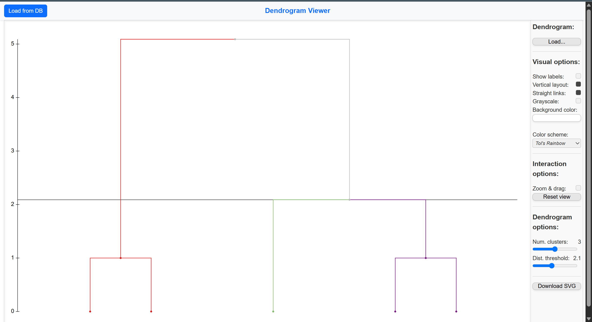

## 📊 Hierarchy explanation

Le principali cartelle di questo progetto sono:

- **Client**  
  Contiene un main da chiamare per connettersi al server TCP del server.

- **Server**  
  Contiene tutti i moduli necessari per il clustering.

- **Servlet**  
  Integra tutte le servlet utili per il frontend.

## 🚀 Avvio del programma

### Requisiti

- [Java 21](https://www.oracle.com/java/technologies/javase/jdk21-archive-downloads.html)
- [Docker](https://www.docker.com/)
- [Docker Compose](https://docs.docker.com/compose/)


## ⚠️ Importante: Esegui lo script SQL

Per garantire che l'applicazione funzioni correttamente, è necessario eseguire lo script SQL presente nella cartella `docker-config`, sul proprio database. Questo script è essenziale per configurare il database e prepararlo per l'interazione con l'applicazione.\
>**In modalita full-feature il database si configurerà da solo.**

Il programma può essere avviato in due modalità:

### Modalità Full-Feature (con Docker e Tomcat)

1. **Docker**: Per avviare il programma in modalità full-feature, è possibile utilizzare Docker. Assicurati di avere Docker installato e configurato correttamente sulla tua macchina.
   
2. **Tomcat**: Il frontend del progetto è integrato con Tomcat. Una volta avviato Docker, il server Tomcat si occuperà di gestire il lato frontend, mentre il backend sarà attivo e pronto per gestire le richieste.

   Seguendo questi passaggi, puoi avviare l'intero sistema in modalità completa con Docker e Tomcat.

### Modalità Shell
1. **MainDataTest**: presupponendo che il Db sia online e correttamente configurato secondo quanto detto sopra, è possibile avviare questo modulo per caricare il primo dataset nel DB, i successivi potranno essere caricati tramite il client.** A patto che sia in funzione e il server TCP avviato.** 

2. **Server**: avvia il programma inizialmente nel package `Server`. Per farlo, esegui il main presente in questo package per avviare il server.
   
3. **Client**: Successivamente, avvia il main nella classe `PassiveClient`, che si trova nel package `Client`. Questo avvierà la connessione al server TCP e permetterà l'interazione tra i moduli.

Queste due modalità ti permettono di scegliere come eseguire il programma a seconda delle tue esigenze e configurazioni.

## 🚀 Avvio dell'applicazione in modalità Full-Feature

Per avviare l'applicazione in modalità *full-feature*, utilizziamo Docker per il backend e Tomcat per il frontend. Segui i passaggi sottostanti per eseguire il programma.

### Prerequisiti
Assicurati di avere i seguenti strumenti installati e configurati:
- **Docker**: Necessario per eseguire il container del backend e del frontend.
- **Gradle**: Per la gestione del build del progetto.

### Passaggi per avviare l'applicazione

1. **Posizionati nella cartella principale del progetto**.

2. **Costruisci il progetto e crea il file WAR**:
   - Esegui i seguenti comandi per costruire il progetto e generare il file WAR per il deploy su Tomcat.

#### Ambiente Bash (Linux/macOS)

```bash
# Costruisci il progetto
./gradlew build

# Esegui il task per generare il file WAR
./gradlew task war

# Avvia Docker e i container necessari
docker-compose up
```

#### Ambiente Windows

```bash
# Costruisci il progetto
./gradlew.bat build

# Esegui il task per generare il file WAR
./gradlew.bat task war

# Avvia Docker e i container necessari
docker-compose up

```
## 🌐 Accesso al Frontend

Se il programma è stato avviato correttamente, puoi accedere al **frontend** dell'applicazione nel tuo browser all'indirizzo:

[http://localhost:8080/clusteringwebapp/](http://localhost:8080/clusteringwebapp/)

### Cosa aspettarsi:

Una volta che l'applicazione è in esecuzione, puoi aprire il browser e navigare all'URL sopra indicato. Il frontend sarà visibile e interattivo. 

### Screenshot del Frontend

Qui di seguito un esempio dell'interfaccia che dovresti visualizzare:



> **Nota**: Assicurati che il container DB e il container Docker siano in esecuzione per poter accedere al frontend correttamente.

# Note Finali

Nonostante il servizio di clustering sviluppato sia stato progettato per essere **generico** e **input-proof**, si evidenzia che il progetto **non è ancora pronto per una fase di produzione**.

In particolare:
- **Vulnerabilità CSRF**: Il sistema è attualmente esposto a possibili attacchi di tipo Cross-Site Request Forgery, in quanto mancano meccanismi di sanitizzazione dei campi che verranno mostrati nel frontend.
- **Vulnerabilità SQL Injection**: Non sono stati ancora implementati sufficienti livelli di sanitizzazione e parametrizzazione delle query, rendendo il sistema vulnerabile ad attacchi di tipo SQL Injection.

Si raccomanda, pertanto, un'approfondita fase di hardening e testing di sicurezza prima di qualsiasi utilizzo reale o distribuzione in ambienti di produzione.

---

# Ringraziamenti

Un sentito ringraziamento a **Pedro Pereira** per aver sviluppato il componente JavaScript di **conversione da JSON a SVG**, fondamentale per la **visualizzazione dei dendrogrammi**.

Il suo contributo ha permesso una rappresentazione grafica chiara e funzionale dei risultati del clustering.

